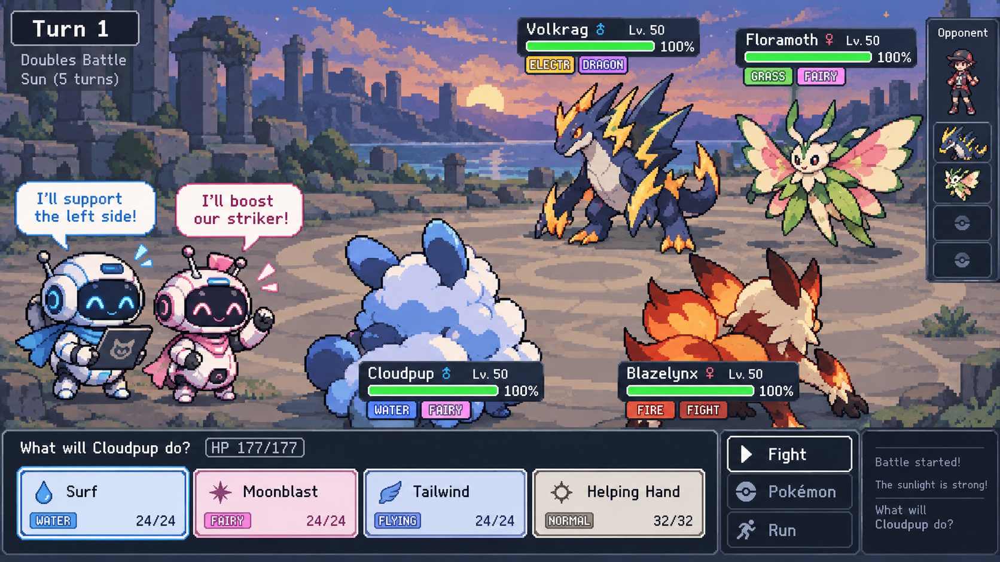

# Pokemon Showdown Multi Agent Collaberation RL



Two LLM agents play as teammates in Pokémon Showdown 4-player Multi Battles
(`gen9multirandombattle` with Terastallization off): seats p1 + p3 against p2 + p4, each player
controlling one active Pokémon from a team of 3. Before acting, teammates talk privately; each then
chooses its own move, and choosing ends its talking (its partner is told what it chose).

**Status:** Phase 1 (environment and scripted bots) is done. Phase 2 is in progress: agent
observations and the talk loop are built and tested with scripted agents; the model client is next.

## Setup

Requires Node.js 18+ and Python 3.11+.

```bash
cd bridge && npm ci && cd ..
python -m venv .venv
.venv/Scripts/python -m pip install -e ".[dev]"   # .venv/bin/python on Linux
```

## Use

```bash
pokerl teams --size 32 --label v1                 # regenerate data/teams/pool-v1.json
pokerl run --label demo --side-a maxpower --side-b random --pairs 50
pokerl replay runs/demo/battles.jsonl demo-00000  # writes runs/demo/replays/demo-00000.html
pokerl check                                      # Phase 1 acceptance checks
pytest && ruff check src tests
```

`run` plays each seed twice with the teams swapped between sides (`--no-mirror` to disable),
writes one JSON line per battle to `runs/<label>/battles.jsonl`, and a `summary.json`.
Use `--p1 ... --p4` to put different policies in individual seats.

In Python:

```python
from pokerl.bridge import Bridge
from pokerl.env import MultiBattleEnv
from pokerl.teams import load_pool, make_specs

with Bridge() as bridge:
    env = MultiBattleEnv(bridge)
    spec = make_specs(load_pool(), 1, "example")[0]
    views = env.reset(spec.seed, spec.teams)      # {seat: SeatView}
    while not env.ended:
        env.step({seat: views[seat].choices[0] for seat in env.pending})
    print(env.winning_side)                        # "p1p3" or "p2p4"
```

A `SeatView` holds that seat's own log channel, its Showdown request, its ally's full team, and
its legal actions (each a Showdown choice string plus facts about the move and its targets).
`env.save()` / `env.load(snapshot)` resume a battle exactly; `env.input_log()` is Showdown's own replayable log.

## Layout

```
bridge/bridge.js      Node process hosting Showdown battles (JSON lines over stdin/stdout)
src/pokerl/env.py     MultiBattleEnv: reset / step / save / load, per-seat views
src/pokerl/bots.py    random and max-power policies; BotSide controller
src/pokerl/tracker.py public battle state rebuilt from one player's log
src/pokerl/narrate.py battle events in plain English from one player's view
src/pokerl/observation.py  the per-turn message an agent reads, with numbered options
src/pokerl/talk.py    TalkingTeam controller: teammates talk (say) and choose
src/pokerl/dex.py     cached names, types and descriptions from Showdown's data
src/pokerl/teams.py   team pools and battle specs (seeds, mirrored pairs)
src/pokerl/runner.py  play battles, parallel batches, JSONL logs, summaries
src/pokerl/replay.py  Showdown replay pages
data/teams/           fixed team pools
runs/                 batch outputs (not tracked)
```

## Phase 1 results (2026-10-02, laptop, 6 worker processes, Terastallization off)

| Check | Result |
|---|---|
| Max-power (p1+p3) vs random, 1,000 battles on 500 mirrored seeds | 99.6% wins (95% CI 99.0–99.8%), 0 crashes, 8.7 turns on average |
| Random vs random, 250 battles | 46.4% (CI 40.3–52.6%), 0 crashes, 17.7 turns on average |
| Same seed, same choices → same battle | 100/100 |
| Save mid-battle, resume twice → both match the uninterrupted battle | 100/100 (after fixing a Showdown Multi Battle save/load bug in the bridge) |
| Rejected choices | 24, all switches blocked by a hidden trapping ability (real Showdown behavior) |
